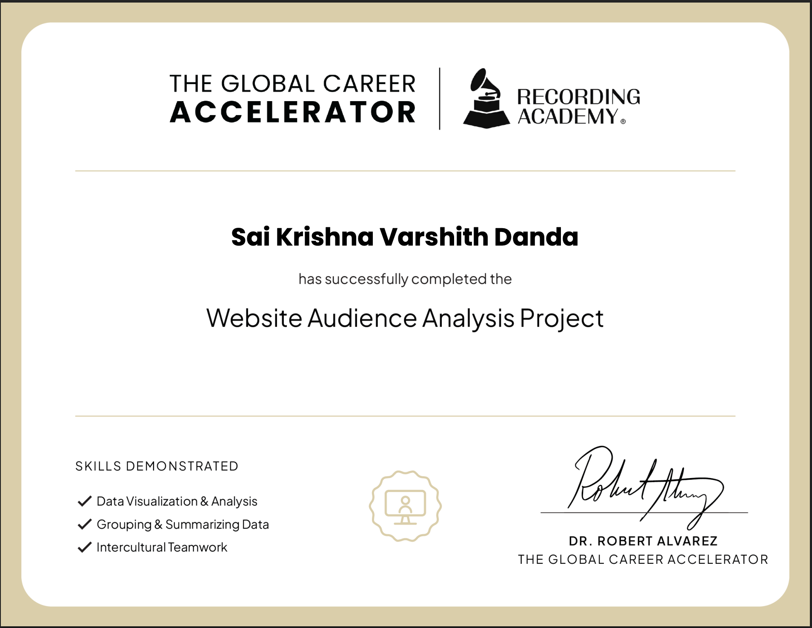

# Recording Academy Web Analytics

Analyzing the impact of splitting grammy.com and recordingacademy.com into two separate domains.

## View Notebook
[Click here to view the full notebook with visualizations](https://nbviewer.org/github/Varshith-Danda/recording-academy-web-analytics/blob/main/notebook/Recording_Academy_Web_Analytics.ipynb)

## Overview

In February 2022, The Recording Academy — the non-profit behind the Grammy Awards — split their single website into two domains. This project analyzes whether that decision improved audience engagement using real web traffic data spanning 2017–2023.

**Key findings:**
- recordingacademy.com outperforms the old combined site on every engagement KPI
- grammy.com drives 38x more traffic than its main competitor, the American Music Awards website
- Grammy Awards night produces 43x more traffic than a normal day — the site's biggest challenge is year-round engagement

## Project Structure
```
recording-academy-web-analytics/
├── datasets/        ← 6 CSV data files
├── images/          ← Certificate
├── notebook/        ← Jupyter notebook
└── README.md
```

## Tools Used

- Python
- pandas
- numpy
- plotly

## How to Run

1. Clone the repo
2. Install dependencies: `pip install pandas numpy plotly jupyter`
3. Open Jupyter from the root of the repo folder, then navigate to `notebook/Recording_Academy_Web_Analytics.ipynb`

## Certificate


